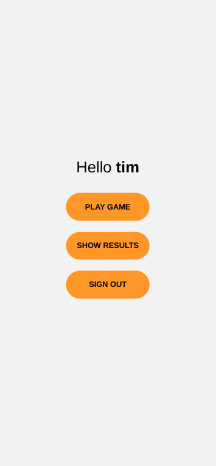

# Paper Scissor Stone App

# Environment

- Ubuntu20.04 
- Flask (Server)
- React Native (Client)
- MongoDB (Database)

## Introduction

We build a papser scissor stone app by using flask as server system for routing and using react native as client system for user to play the game and view their result. This application contains sign-up, log-in, and log-out authentication system. The user informations are processed, encrypted, and stored in server-side mongo database. The game alogorithm is also processed in server system. 

## Demonstration

- 

- 

- 

- 

- 

## Installation

- Install [mongodb](https://www.mongodb.com/docs/manual/tutorial/install-mongodb-on-ubuntu/) with [mongo compass](https://www.mongodb.com/docs/compass/current/install/) (optional)

- Install [miniconda](https://docs.anaconda.com/free/anaconda/install/linux/) (optional)
- Install [React Native](https://reactnative.dev/docs/environment-setup)

## Instruction

### Start Systems

(*Make sure router is on and both mobile device is connected to same router before getting started*)

### Start Mongodb

```
$ sudo systemctl start mongod
```

- Open mongodb compass to view mongodatabse


### Start Server System

```
$ sudo systemctl start mongod.service
```

```
$ cd ./server
```

```
$ pip install -r requirements.txt
```

- Create **.env** in the server directry and put the local mongodb address

```
MONGODB_URL="Your-local-mongodb-address"
```

```
$ ./run
```

### Start Client System

```
$ cd ./client/PaperScissorStoneApp/
```

```
$ npm install
```

- Create **.env** in the server directry and put the local mongodb address

```
SERVER_IP="Your-local-server-ip-address"
```

```
$ npx expo start 
```

- Open Expo Go in mobile and scan qrcode

## References
- [LukePeters/user-login-system-assets](https://github.com/LukePeters/user-login-system-assets)
- [Sort dict of dict in jinja2 loop](https://stackoverflow.com/questions/43541890/sort-dict-of-dict-in-jinja2-loop)
- [SORT DICT IN JINJA2 LOOP](https://www.appsloveworld.com/coding/flask/2/sort-dict-in-jinja2-loop)
- [Install NodeJS 16 on Ubuntu 20.04](https://www.stewright.me/2022/01/tutorial-install-nodejs-16-on-ubuntu-20-04/)
- [How to Pass Parameters to screen in StackNavigator?](https://stackoverflow.com/questions/45388957/how-to-pass-parameters-to-screen-in-stacknavigator)
- [【极简】传输formdata时出现415 unsupported media](https://blog.csdn.net/Yonggie/article/details/135766096)
- [React-native API call using Fetch](https://medium.com/featurepreneur/react-native-api-call-using-fetch-f0ee847b5ed0)
- [React Native Networking – How To Perform API Requests In React Native using the FetchAPI](https://www.freecodecamp.org/news/react-native-networking-api-requests-using-fetchapi/)
- [Flask 框架：运用Axios库实现前后端交互](https://www.cnblogs.com/LyShark/p/16009161.html)
- [Using ASYNC STORAGE w/React Native & Expo](https://www.youtube.com/watch?v=PhhyBmAIehg)
- [使用 Effect Hook](https://zh-hant.legacy.reactjs.org/docs/hooks-effect.html)
- [Height and Width](https://reactnative.dev/docs/height-and-width)
- [React Native Scrollview height not changing to fit children elements](https://stackoverflow.com/questions/68932523/react-native-scrollview-height-not-changing-to-fit-children-elements)
- [How to iterate (keys, values) in JavaScript? [duplicate]](https://stackoverflow.com/questions/34913675/how-to-iterate-keys-values-in-javascript)
- [react native的进度条、table表格和其他组件](https://blog.csdn.net/weixin_44324124/article/details/106050912)
- [Unknown Option error from Babel in React-Native app](https://stackoverflow.com/questions/64225453/unknown-option-error-from-babel-in-react-native-app)
- [zetachang/react-native-dotenv](https://github.com/zetachang/react-native-dotenv)
- [How do I Configure Flask Dev Server to be Visible Across the Network?](https://sentry.io/answers/flask-configure-dev-server-visibility/)